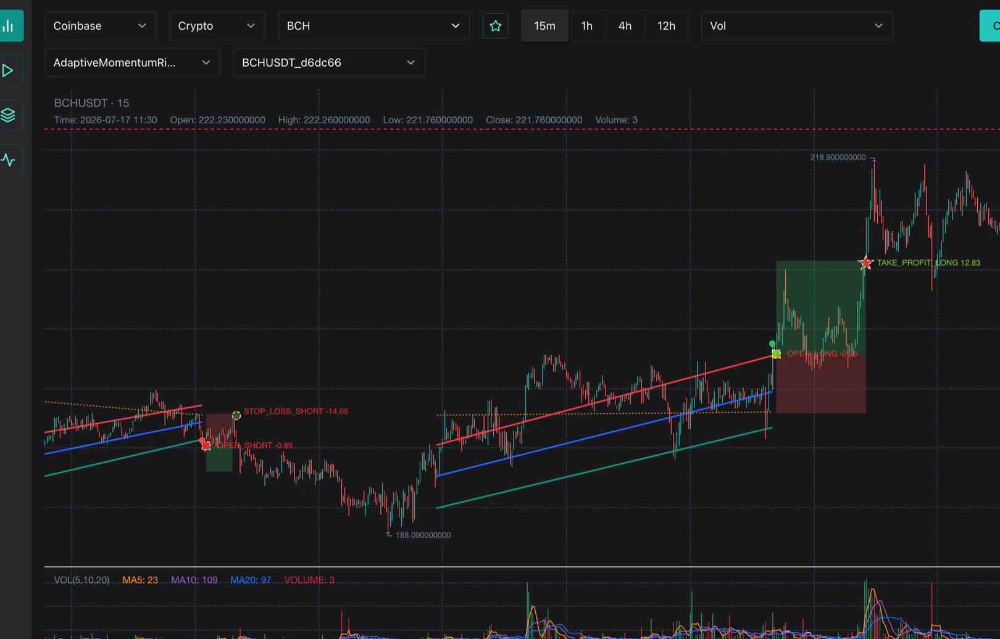
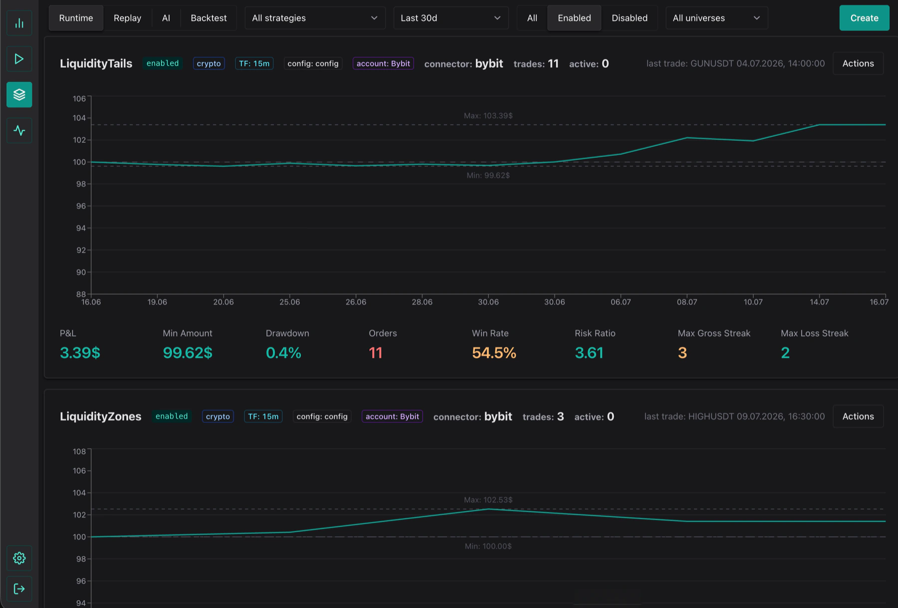

# TradeJS

TradeJS is a TypeScript framework for strategy authoring, backtesting, live signal generation, and optional auto-trading, with a self-hosted runtime you control.

It supports two first-class authoring paths:

- TypeScript strategies built with `StrategyAPI`
- Pine Script strategies embedded as standalone strategy modules (with a separate `.pine` source file)

## TradeJS in Action

[](https://tradejs.dev)

[](https://tradejs.dev)

## Public Resources

### Web

- Site: [tradejs.dev](https://tradejs.dev)
- Documentation: [docs.tradejs.dev](https://docs.tradejs.dev)
- Questions and feedback: [t.me/aleksnick](https://t.me/aleksnick)
- Site repo: [TradeJS-Dev/TradeJS-Site](https://github.com/TradeJS-Dev/TradeJS-Site)
- Docs repo: [TradeJS-Dev/TradeJS-Docs](https://github.com/TradeJS-Dev/TradeJS-Docs)
- Discussions: [GitHub Discussions](https://github.com/TradeJS-Dev/TradeJS/discussions)
- npm organization: [npmjs.com/org/tradejs](https://www.npmjs.com/org/tradejs)

### Published npm Packages

- [`create-tradejs`](https://www.npmjs.com/package/create-tradejs) — one-command external project, infrastructure, login, and first-backtest UI bootstrap
- [`@tradejs/app`](https://www.npmjs.com/package/@tradejs/app) — installable Next.js UI for dashboards, backtests, and runtime data
- [`@tradejs/cli`](https://www.npmjs.com/package/@tradejs/cli) — official CLI for infra setup, backtests, signals, bots, and AI/ML workflows
- [`@tradejs/base`](https://www.npmjs.com/package/@tradejs/base) — default preset wiring built-in strategies, indicators, and connectors
- [`@tradejs/core`](https://www.npmjs.com/package/@tradejs/core) — browser-safe public API for config, strategy authoring, indicators, and shared helpers
- [`@tradejs/node`](https://www.npmjs.com/package/@tradejs/node) — Node runtime for strategies, backtests, Pine strategy loading, and plugin registries
- [`@tradejs/types`](https://www.npmjs.com/package/@tradejs/types) — shared TypeScript contracts for the TradeJS ecosystem
- [`@tradejs/infra`](https://www.npmjs.com/package/@tradejs/infra) — server-only adapters for Redis, Timescale, ML, logging, and IO
- [`@tradejs/strategy-kit`](https://www.npmjs.com/package/@tradejs/strategy-kit) — strategy-neutral authoring helpers
- [`@tradejs/indicators`](https://www.npmjs.com/package/@tradejs/indicators) — built-in indicator plugin catalog
- [`@tradejs/connectors`](https://www.npmjs.com/package/@tradejs/connectors) — built-in exchange connectors and market data providers

Each built-in strategy is now an independently versioned
`@tradejs/strategy-*` package and GitHub repository. TrendLine and
ReverseTrendLine are the only deliberate exception: both ship atomically from
`@tradejs/strategy-trend-line`. See [REPOSITORIES.md](REPOSITORIES.md) for the
complete ownership map.

## Licensing

TradeJS version 2.0.0 and later uses a mixed-license open-core model:

- product components (`@tradejs/app`, `@tradejs/base`, `@tradejs/cli`,
  `@tradejs/node`, the individual strategy packages, and the private ML
  runtime) use the Business Source License 1.1 with an Additional Use Grant
- SDK, integration, scaffolding, and example components (`@tradejs/core`,
  `@tradejs/types`, `@tradejs/indicators`, `@tradejs/connectors`,
  `@tradejs/infra`, `@tradejs/strategy-kit`, `create-tradejs`, and
  `examples/sandbox`) remain under MIT

The Additional Use Grant permits production use, including internal trading,
research, analytics, and operations. Providing a competing product or hosted
or managed service requires a commercial license. Releases through version
1.0.12 remain available under MIT. See [LICENSING.md](LICENSING.md) for exact
package scopes and terms.

## Repository Layout

- `apps/app`: Next.js UI and API
- `packages/core`: browser-safe public API, shared helpers, plugin config API
- `packages/node`: Node-only runtime, plugin loading, backtest/pine execution helpers
- `packages/indicators`: built-in indicators package
- `packages/connectors`: exchange connectors and market data providers
- `packages/cli`: operational scripts (`backtest`, `signals`, `results`, `ai-*`, `ml-*`, `doctor`, etc.)
- `packages/create-tradejs`: external project generator and first-backtest bootstrap
- `packages/ml/python`: Python train/infer/profile services
- `examples/sandbox`: full user-app style sandbox with local `tradejs.config.ts`, custom strategy/indicator/connector plugins, and deterministic backtest/signals e2e flow

Public presets, strategy authoring helpers, strategies, deployment, and web
surfaces are maintained in separate repositories:

- `TradeJS-Base` for `@tradejs/base`
- `TradeJS-Strategy-Kit` for `@tradejs/strategy-kit`
- `TradeJS-Strategy-*` for individual strategy packages
- `TradeJS-Project` for the generated user-owned runtime, local Compose,
  ignored research artifacts/notes, and app image
- `TradeJS-Deploy` for production Compose, TLS, volumes, and server lifecycle
- `TradeJS-Site` for `tradejs.dev`
- `TradeJS-Docs` for `docs.tradejs.dev`

This monorepo no longer contains strategy, Base, production app-container, or
public web-surface source code.

## Core Concepts

### Shared Runtime

All strategies run through the shared runtime in:

- `packages/node/src/strategyRuntime.ts`

Strategy `core.ts` returns one of:

- `skip`
- `entry`
- `exit`

Runtime then handles:

- signal construction and enrichment
- optional ML/AI gating
- order execution and hook invocation

`strategyApi.entry(...)` contract is minimal:

- strategy passes `direction` and `orderPlan` (`qty`, `stopLossPrice`, `takeProfits`)
- strategy may pass optional `code`; if omitted, runtime auto-generates it
- shared runtime resolves signal `timestamp/currentPrice/takeProfitPrice/riskRatio`

### Strategy Registration

Strategies are loaded as plugins via manifests and registry:

- `packages/node/src/strategy/manifests.ts`
- `src/<Strategy>/manifest.ts` in each strategy repository

Each strategy plugin exports a declarative entry with `manifest`, `defaults`,
and `createCore`. The Node registry turns that definition into a server runtime;
strategy packages do not construct or import the Node runtime themselves.

### Pine Strategy Support

Pine strategies are stored as normal strategy modules and keep Pine source in
a dedicated file in their strategy repository:

- `src/<Strategy>/<strategy>.pine`

Pine file loading and execution are explicit server-side operations exposed by
`@tradejs/node/pine`. They are not injected into the browser-safe
`CreateStrategyCore` contract.

Pine support currently applies only to strategy modules. Custom indicator plugins must be authored in TypeScript; standalone Pine indicator plugins are not supported.

### Indicator Architecture

Shared indicator pipeline lives in:

- `packages/core/src/utils/indicators.ts`

Plugin indicators are registered via indicator entries and can add:

- compute series
- optional figure renderers

## Strategy Development And Research

Treat strategy implementation, raw-core research, AI-gate research, and live
deployment as four separate stages. A profitable gate cannot repair an invalid
or non-causal core experiment, and a promising backtest is not permission to
place orders.

Personal operational commands run from `TradeJS-Project`. In research tooling,
`PROJECT_CWD` identifies that project/artifact root, while
`TRADEJS_SOURCE_REPOSITORY_ROOT` identifies the source repository used for Git
lineage and unreleased framework builds. They intentionally may differ:

```bash
cd ~/dev/tradejs/tradejs-project
PROJECT_CWD="$PWD" \
TRADEJS_SOURCE_REPOSITORY_ROOT=~/dev/tradejs/investing \
yarn research:core --help
```

### 1. Implement A Replay-Safe Strategy

Built-in strategies live under `src/<StrategyName>` in their owning
`TradeJS-Strategy-*` repository:

- keep deterministic detector transitions in a replayable `engine.ts` when the
  strategy has pivots, pending confirmations, zones, or other rolling state
- keep position checks, cooldowns, risk sizing, and `entry`/`exit` decisions in
  `core.ts`
- put defaults and typed parameters in `config.ts`; new research behavior should
  normally be default-off so the control remains reproducible
- add deterministic `figures` for geometry that must be inspected on a chart
- cover the legacy control, candidate behavior, LONG and SHORT, duplicate
  timestamps, continuous replay versus `initialCandles`, and config-state
  isolation with unit tests

The complete runtime contract and examples are in [STRATEGY_API.md](STRATEGY_API.md).
Run the complete repository suite before starting a costly experiment:

```bash
yarn checks
```

### 2. Preregister The Raw-Core Experiment

Use `yarn research:core` for control-versus-candidate research. Freeze the
causal claim, ordered universe and checksum, exact half-open UTC window,
resolved configs and their canonical hashes, fees/slippage/entry delay, target
direction, selection rules, and experiment stage before running anything.

```bash
yarn research:core init \
  --out data/research/specs/my-hypothesis.json \
  --researchId my-strategy-family-v1 \
  --strategy MyStrategy \
  --start <epoch-ms> \
  --end <epoch-ms> \
  --symbolsFile data/research/frozen-symbols.json

# Fill causalClaim, stage, variants[].resolvedConfig/configSha256,
# commands or files, and executable selection rules in the generated spec.
yarn research:core prepare --spec data/research/specs/my-hypothesis.json
yarn research:core run --spec data/research/specs/my-hypothesis.json
yarn research:core verify --spec data/research/specs/my-hypothesis.json
yarn research:core index --root data/research/core
```

Use `analyze` instead of `run` when the spec points to already completed,
explicit exports. `--researchTrace` is opt-in and should be used only when the
question needs setup/entry/skip funnel attribution.

The standard evidence progression is:

1. a bounded all-universe `screen` for selection
2. an isolated, single-config `isolated_long` run for long-window evidence
3. `confirmation` with non-fast execution, cold-start/reset sensitivity, cost
   and delay stress, and runtime parity where applicable

Every config and window reports fixed `ALL`, `LONG`, and `SHORT` cohorts with
`N`, PnL, PnL/trade, PF, WR, realized MaxDD, and cadence/day. Both directions
remain enabled in the raw-core config. A losing side is evidence to investigate
or gate later, not a result to hide. Aggregate portfolio guardrails and a
direction-targeted causal verdict remain separate.

`yarn backtest --ai` is only raw completed-core-trade transport in this stage;
it does not mean the AI gate approved those trades. Exports are accepted only
after a completed manifest, full checkpoints, explicit run-scoped export, and
Redis-versus-JSONL reconciliation:

```bash
yarn ai-export --strategy MyStrategy --runId <run-id> --partMonths 0 --keepChunks
yarn node -r dotenv/config \
  .codex/skills/strategy-backtest-research/scripts/fast-ai-export-metrics.mjs \
  --file <merged-export.jsonl> --run <run-id> --json
```

The full spec, artifact, statistical, performance, and verification contract is
in [CORE_RESEARCH.md](CORE_RESEARCH.md). Immutable local findings belong in
`TradeJS-Project` at `notes/<Strategy>/YYYY-MM-DD-<slug>.md`; `notes/` is
intentionally ignored and must never be committed.

### 3. Research The AI Gate Separately

Only after the core candidate has valid evidence should the same immutable
export be used for gate research. A side-qualified handoff is also valid input
when one raw direction has a frozen useful edge and the opposite direction is
the dominant aggregate loss; it remains labelled as a failed raw aggregate
until an explicit direction policy is tested. Discover causal pockets with a
time-ordered holdout, then replay the deterministic local gate over all
selected rows:

```bash
yarn ai-pocket-search --strategy MyStrategy -n 0 \
  --validationSplit 0.2 --testSplit 0.2 --sealTest \
  --maxDepth 2 --minSupport 25
yarn ai-train --strategy MyStrategy --localOnly -n 0 --minQuality 4 --json
```

Evaluate qN+ streams, terminal windows, regimes, symbols, and LONG/SHORT
separately. Gate inputs must exist at signal time; delayed fills, exit reasons,
and realized PnL are outcomes, never features. `AI_MODE=gate` is comparable to
`ai-train --localOnly`; `AI_MODE=llm` requires provider-backed evidence and must
not inherit local-gate claims.

Do not silently turn `SHORT.enable=false` or `LONG.enable=false` to make raw
metrics look better. Keep both directions in the raw export, then test an
explicit deterministic-gate policy (`both`, `long_only`, `short_only`, or a
direction-aware rule). This preserves the rejected side as counterfactual
evidence while allowing a retained side to become the released composition.
When one side is useful and the other supplies the dominant loss, the release
workflow must run five frozen variants: current gate, failing-side block,
retained-side pass-through plus block, causal repair of the failing side, and a
direction-aware replacement. Recent-window and cost failures can still reject
the one-side composition; they are not a reason to skip the experiment.

For a release lineage, `--sealTest` keeps the final timestamp-grouped tail out
of discovery and current-gate economics while recording its immutable bounds.
Freeze the five gate variants, then open that tail exactly once with the shared
gate-ablation tool. Plain `--testSplit` produces useful historical diagnostics
but exposes the tail; it cannot later be relabelled an untouched release test.

### 4. Issue A Strategy Release Verdict

The repository-local `$strategy-release` skill turns verified core and gate
evidence into one composition-level decision. It has `release` and
`diagnose-live` modes. Release mode starts with a strategy-history audit: it
maps behavior-changing Git commits and dirty patches to immutable research
evidence, rejects refactor-only/duplicate/already-tested entries, and bridges
every stronger prior result onto the current frozen window, universe, config,
cost, and context contract. It then runs three sequential core-improvement
rounds within the fixed budget: one anchor candidate for each of three causal
families, then two evidence-driven child candidates per still-viable family in
each of two refinement rounds. Untested historical mechanisms take priority
over novel anchors.

A bridge rerun of a different core behavior/config is a real candidate and
counts in the same family-aware trial ledger; rebuilding the unchanged control
or normalizing its metadata does not. If the 18-candidate cap is exhausted
while a stronger reconstructable historical result remains unbridged, the
result is `INSUFFICIENT_EVIDENCE`, not a claim that the strategy has no edge.

After round 3, the skill must build a Pareto rescue board from all complete,
reconciled, non-no-op candidates. It selects up to three diagnostic seeds with
different cadence (one per observed cadence tercile when possible), diagnoses
each seed's dominant metric/identity/trace failure, and runs one causal core
rescue child per seed. The resulting cap is 18 candidates: 15 across the three
family rounds plus three rescue attempts. Only after this board may it freeze
one isolated-long finalist or conclude that no finalist exists. A failed seed
is diagnostic evidence, not a silently promoted control. Rescue seeds need not
pass the release rule: low support/cadence, failed Holm, negative terminals, or
negative PnL are precisely the failure modes the bounded child must address.
Direction-targeted families separate seeds by target-side cadence and preserve
ALL cadence as an aggregate guardrail; whole-strategy families use ALL cadence.
`STOP_RESEARCH` is forbidden until the history bridge, three core rounds, and
all available rescue slots are complete. An unused rescue slot requires a
recorded hard reason: no cadence-distinct complete candidate or no causal
point-in-time child capable of addressing its measured failure.

Before a no-finalist conclusion, the skill must also run the mandatory
direction-policy checkpoint. A positive raw LONG mixed with a losing SHORT (or
the reverse) is a composition-design question, not an automatic
`STOP_RESEARCH`. The best complete side-qualified handoff may consume the
single isolated-long slot and enter the one gate round without being relabelled
an eligible raw-core winner. `UNSUITABLE_FOR_CURRENT_MARKET` is valid only after
that policy is tested or a frozen useful-side rule proves that neither side can
be salvaged.

Each round uses `yarn research:core` with `--researchTrace` and must finish a
full result analysis before the next specs are frozen: ALL/LONG/SHORT metrics,
payoff and drawdown tails, matched/control-only/candidate-only/changed trades,
occupancy spillover, deterministic setup identities, signal/rejection→execution
→exit trace conversion, skip reasons, time folds/months, causal signal-time
regimes, concentration, cost stress, and statistical/overfitting diagnostics. Round-2 variants cite
round 1; round-3 variants cite rounds 1 and 2 through immutable parent research
IDs and state their predicted trace/metric effects. A chronological release
tail stays sealed during these rounds and the rescue board and is opened once
after rescue for the single long finalist over the maximum common cached
window. Every historical backtest uses `--cacheOnly`.

Each family/round also persists a hashed causal handoff containing the parent
result hashes, eligible carried control, predicted-versus-observed effect,
`supported|falsified|inconclusive` mechanism verdict, remaining failure mode,
and the exact next config deltas. This makes the next Codex iteration dependent
on immutable evidence rather than on a remembered PnL ranking.

The final response must expose the audit instead of hiding it in artifacts:
`HISTORY AUDIT` identifies the inventory SHA and resolved/unresolved counts,
`PRIOR BRIDGE` states what happened to the strongest earlier result, and
`RESCUE BOARD` lists every selected seed's cadence, failure, child, and result
or the hard reason an available slot could not be used.

An audit, architecture fix, or data-quality discovery is not itself a strategy
improvement attempt. The release skill writes a progress payload and runs
`release-progress-checkpoint.mjs` after the baseline and every round. When the
checkpoint says `RUN_CORE_ROUND_1`, `RUN_CADENCE_RESCUE_BOARD`, or
`RUN_DIRECTION_POLICY_CHECKPOINT`, Codex must perform that bounded action before
returning a final verdict.

The bounded loop still requires professional judgment. Before round 1, Codex
writes the strategy's market thesis and an opportunity map across setup
formation, entry timing, risk geometry, lifecycle, side/regime, concentration,
and execution. It chooses one exploit family, one repair family, and one
explore/falsify family from competing mechanisms. After each round it updates a
belief ledger from metric, identity, regime, cost, and trace evidence. This
prevents both random threshold grids and rigid checklist execution.

Historical universe provenance controls the claim ceiling rather than acting
as a generic stop switch. A current deployable cohort replayed through older
cached candles may support matched control/candidate research and a prospective
risk-1 handoff, but not an unconditional exchange-wide historical robustness
claim. Record it as `micro_forward_only`, run available membership sensitivity,
and resolve the remaining uncertainty with forward evidence instead of waiting
for a perfect historical membership archive.

The response must also expose `DIRECTION POLICY`, a complete window matrix,
and the standard AI-gate report. This remains mandatory when the result is
negative. Show the authoritative control, best aggregate, best LONG, best
SHORT, and rescue/policy attempts over full, 3y, 4y,
5y-or-maximum-covered, 365d, 180d, 90d, 30d, and 7d windows. Then follow the
`$ai-train-local-research` tables for outcome/tail risk, cadence/fan-out,
risk-adjusted metrics, quality/direction, execution bridge, validation,
acceptance checks, and reject reasons. Use `n/a`; never omit a section or leave
the detailed statistics only inside an ignored note.

Create a draft JSON that references verified core, gate, runtime-parity, and
execution-calibration artifacts. It also freezes equal-length historical
drawdown envelopes and baseline core/gate expectancy for later live diagnosis:

```bash
yarn strategy:release profile \
  --input data/research/core/<research-id>/trades.jsonl \
  --variant <finalist-id> --startTime <ms> --endTime <ms> \
  --days 7,30,90 --out data/research/releases/DoubleTap-profile.json

yarn strategy:release create \
  --input data/research/releases/DoubleTap-draft.json \
  --root data/strategy-release

yarn strategy:release verify \
  --input data/strategy-release/releases/DoubleTap/<release-id>.json
```

`create` reads, hashes, validates, and derives the release gates from every
referenced evidence file itself. Draft `verified` and gate booleans are
cross-checks, never authority: core readiness comes from a reconciled final
core-research result and complete robustness matrix; gate value comes from the
local-deterministic gate result and complete positive terminal windows; parity
and execution safety come from their measured artifacts. It writes a
release envelope plus compact G/L/E/D/R chart markers under the ignored
`data/strategy-release` tree. The only release verdicts are
`READY_FOR_RUNTIME`, `UNSUITABLE_FOR_CURRENT_MARKET`, and
`INSUFFICIENT_EVIDENCE`. No verdict changes runtime config, `MAX_LOSS_VALUE`,
orders, daemons, or promotion state.

The frozen composition records separate identities for the canonical resolved
core config (`coreConfigSha256`), the exact core JSONL export
(`coreExportSha256`), deterministic-gate config IDs and context, and the
effective runtime config/context. `create` derives the same identities from the
referenced artifacts and rejects cross-lineage evidence; a checksum-valid gate,
parity, or execution report from another git/config/context logic lineage
cannot certify the release.

`MAX_LOSS_VALUE` is frozen in each research/economic artifact but is tracked as
a separate risk-scale lineage. Changing it does not create a new core + gate
logic identity or hide the prior evidence timeline. Instead it creates a
checksum-verified `L` marker; live PnL and drawdown are divided by the
runtime/release risk-scale ratio before comparison with historical envelopes.
If either scale is unknown, economic attribution remains insufficient.

The final composition is also reported on trailing 3-year, 4-year, and
5-year-or-maximum-available cached slices. If the cache contains 1800 rather
than 1825 days, the report says `requested=1825, covered=1800`; it never calls
that a complete five-year sample. Every slice keeps fixed ALL/LONG/SHORT
cohorts. A negative 30d side with only a handful of trades is not a license to
fit another threshold: a terminal-direction repair requires at least 20
independent target-side trades, a preregistered causal mechanism, an untouched
tail, and an unused repair round.

Finish release research by persisting the exact final gate's full-period chart
and deriving a separate next action:

```bash
yarn ai-train --strategy DoubleTap --file <merged-part1.jsonl> \
  --localOnly --chart --json --output output/DoubleTap-full-chart.json \
  -n 0 --minQuality 4 --directionPolicy <policy> \
  --terminalWindows=1460,1095,365,180,90,30,7

yarn strategy:release decide \
  --input data/research/releases/DoubleTap-decision-input.json \
  --out data/research/releases/DoubleTap-decision.json
```

The decision input references the chart report as
`chartArtifact: { path, sha256 }`; the command recomputes the checksum and
validates that the report is a successful full-period local deterministic run.
It also requires an exact `runtimeTarget` object (`userName`, `deploymentId`,
`accountId`, `strategyName`, `version`) before returning
`START_MICRO_FORWARD`.
Research normally uses local Redis while production accounts live on a separate
runtime server. Use `null` locally to produce a portable `MICRO_FORWARD_READY`
handoff with `requiresRuntimeBinding=true`; this is not a failed research
verdict. The authorized rollout is completed in `TradeJS-Project`: update the
strategy package dependency and the strategy's full runtime config in the same
`tradejs.config.ts` commit, increment its positive integer `version`, build the
image, and deploy that immutable Project SHA. Account credentials remain in the
server-owned trading-account record and are never committed. Any production
config change, including `MAX_LOSS_VALUE`, increments the Project strategy
version; it need not create a new research composition when trading logic is
unchanged.

`decide` returns a bounded repair, `START_MICRO_FORWARD`, an explicit blocker,
or stop. When the user has authorized automatic forward testing and the exact
runtime account/deployment target is resolved, an exposed holdout or sparse
recent tail does not mean “wait”: the frozen candidate starts prospective
testing with `MAX_LOSS_VALUE=1`. This does not promote the strategy, increase
risk, or permit unrelated runtime changes.

The profile generator scans the selected normalized JSONL variant once, then
calculates daily-stepped equal-length drawdown windows with indexed timestamp
lookups. The draft also freezes its prospective sample floor, minimum parity
ratio, and maximum acceptable order-failure rate; live diagnosis therefore does
not depend on mutable defaults. It also freezes the minimum causal-regime
coverage required for a generalization attribution.

### 5. Forward-Test And Diagnose Without Retuning

Collect prospective evidence for the exact released composition in four books:
micro-live executions, shadow composition, shadow raw core, and deterministic
gate versus LLM comparator. The comparator is advisory and initially runs only
on AI-approved candidates.

```bash
yarn runtime:evidence --daily \
  --publishDir output/runtime-evidence --deployment production
yarn runtime:evidence:sync --source <runtime-host-ready-directory> \
  --deployment production
yarn replay:evidence -- --startTime <ms> --endTime <ms> --cacheOnly
yarn runtime:scorecard \
  --strategy <Strategy> \
  --runtimeEvidence <verified-runtime-evidence.json> \
  --replayEvidence <replay-runtime-evidence.json> \
  --calibration <execution-calibration.json> \
  --prospectiveEvidence <raw-core-gate-regime-summary.json> \
  --releaseManifest <verified-release-envelope.json> \
  --diagnosisDays 7 --strategyReleaseRoot data/strategy-release
```

The scorecard reports the causal funnel, execution residual, rolling outcomes,
and AI-versus-LLM disagreements. With a release manifest it emits one advisory
diagnosis: `RUNTIME_DIVERGENCE`, `EXPECTED_DRAWDOWN`,
`GENERALIZATION_FAILURE`, or `INSUFFICIENT_EVIDENCE`. Runtime divergence has
priority over economics; a non-parity period cannot prove generalization.
Every runtime evaluation, signal, and trade in the scorecard must resolve to one
clean git/config/gate/context logic lineage equal to the release manifest, plus
a valid risk scale. Missing, dirty, conflicting, or different logic lineage is
runtime divergence; missing risk scale leaves economic attribution insufficient.
Research evidence remains a local/CI diagnostic input. Production does not
load release artifacts or use composition ids, git SHAs, or fingerprints to
select config. The Strategies UI therefore has no `Evidence: missing` state:
it renders the committed Project declaration and observed runtime trades only.

Retention defaults are 3 days for operational Redis evidence, 14 days for
verbose payloads, 90 days for verified aggregated runtime bundles, and forever
for compact ledgers/manifests/markers. Cleanup is dry-run unless `--apply` is
explicit and never deletes unverified or unaggregated evidence:

```bash
yarn strategy:release retention --input <retention-inventory.json>
yarn strategy:release retention --input <retention-inventory.json> --apply
```

### 6. Promote And Launch Gradually

Promote only one fully resolved config. Backtest configs remain local Redis
research inputs; production runtime config exists only in the committed
`TradeJS-Project/tradejs.config.ts` declaration. The strategies screen at
`http://localhost:3000/routes/strategies` renders it read-only and may only
pause or resume new entries.

Use an explicit rollout ladder:

```bash
# 1. Build and validate the exact released working tree.
yarn checks

# 2. Commit the package + config + version change in TradeJS-Project, build its
#    production image, and deploy the immutable Project SHA.

# 3. Verify the image-owned declaration and server-owned account binding.
yarn runtime-control verify --user root --deployment <deployment>

# 4. Evaluate one closed-candle cycle without notifications or orders.
yarn signals -- --user root --deployment <deployment> --cacheOnly

# 5. Compare recent replay/backtest entries with recorded runtime evidence.
yarn runtime-parity -- --user root --connector bybit --days 3 --details

# 6. Observe notifications, still without order placement.
yarn signals:daemon -- --user root --deployment <deployment> --notify

# 7. Enable orders only after the earlier stages and account/risk review pass.
yarn signals:daemon -- --user root --deployment <deployment> --notify --makeOrders
```

The signals daemon reloads the image-owned deployment and optional Redis pause
overrides on every cycle. Pause/resume takes effect without a restart. Config,
version, ticker, connector, or account declaration changes arrive only through
a new immutable Project image, whose replacement session is rebuilt from
closed-candle warmup data before it may place a new order.

Monitor signal evaluations, gate-versus-LLM disagreements, order rejects,
slippage, parity mismatches, cadence, and realized ALL/LONG/SHORT economics.
Rollback by pointing the deployment at an earlier release in
`entries_paused`, verifying it, and then explicitly resuming entries. The
production runtime may use
a different host and Redis, so verify the actual deployment source of truth
instead of assuming this checkout's local Redis is live.

For environment setup, runtime evidence commands, and operational details, see
[QUICKSTART.md](QUICKSTART.md).

## Quick Start

### 1. Prerequisites

- Node.js `24.17.0` (see `.nvmrc`)
- Yarn `4.x`
- Docker + Docker Compose

### 2. Install

```bash
corepack enable
nvm use
yarn
```

### 3. Start Infra

```bash
yarn infra-up
yarn doctor
```

### 4. Run App

```bash
yarn dev
```

Open `http://localhost:3000`.

Useful routes:

- `http://localhost:3000/routes/backtest` — saved backtest runs and detail pages
- `http://localhost:3000/routes/dashboard` — chart view for signals and market inspection

## Common Commands

```bash
yarn checks
yarn build:ci
yarn backtest
yarn research:core
yarn research:core:test
yarn research:core:coverage
yarn strategy:release
yarn results
yarn signals -- --deployment <deployment-id>
yarn signals:daemon -- --deployment <deployment-id> --notify --makeOrders
yarn runtime:evidence
yarn runtime:evidence:sync
yarn runtime:scorecard
yarn signals:summary -- --printOnly
yarn bot
```

## Automated npm Releases

Every relevant push to `stable` creates an ephemeral shared next-patch version
such as `3.1.8-beta.<workflow-run>`. The workflow builds, lints, typechecks,
tests, dry-runs and publishes that exact prerelease under `beta-candidate`, then
runs quickstart, sandbox, and a production-like `TradeJS-Project` Docker smoke
against registry-installed packages. Only a fully successful run moves the npm
`beta` tag, so a failed candidate cannot replace the last verified beta. Pushes
never update `latest`, commit package versions, create stable Git tags, or deploy
the beta image to production.

`.github/workflows/promote-release.yml` runs Mondays at `03:00 UTC`. It resolves
the current `beta` tag, proves that the matching source SHA completed the full
beta workflow, promotes it to one stable patch, reruns stable checks, commits the
shared version and creates `v<version>`. A protected manual dispatch is the
emergency path. `TradeJS-Project` then batches all newly promoted stable
framework, base, kit, and strategy packages at `06:00 UTC` into one exact
composition, one image, and one production rollout. Production never consumes
an npm prerelease.

The selected-repository organization secret `NPM_TOKEN` must contain an npm
automation-capable token with publish access to the `@tradejs` organization.
GitHub Actions also receives `id-token: write` permission for npm provenance.
Do not add npm tokens to `.npmrc`, `.yarnrc.yml`, or repository files.

Routine local stable publication is not part of this release train. Use
`yarn publish:packages:dry` for inspection; reserve real manual publication for
an explicitly approved recovery. Exact obsolete versions are removed only by
the protected `npm-cleanup.yml` workflow, which rejects current dist-tags and
the configured immutable runtime versions.

Data refresh and integrity:

```bash
yarn update-history -- --user root --config TrendLine:base --connector bybit --timeframe 15
yarn continuity --user root --timeframe 15 --provider bybit
```

## Telegram Notifications

- Telegram bot credentials are configured per user via `TG_BOT_TOKEN` and `TG_CHAT_ID` in the app settings drawer.
- `yarn signals -- --notify` sends runtime signal notifications; `skipped` and `canceled` signals are filtered out and not delivered to Telegram.
- `yarn signals:daemon -- --notify --makeOrders` keeps bounded StrategyAPI detector state between closed candles while disposing each heavy runtime and indicator controller after evaluation. It rebuilds state from the rolling warmup window after a restart, candle gap, config change, or bounded-history limit. Production caps its Node heap at `SIGNALS_DAEMON_HEAP_MB` (4096 MB by default) and logs RSS/heap usage after every cycle.
- The Bybit signals daemon uses one persistent public kline WebSocket by default. Confirmed candles are batch-upserted into Timescale; REST remains the automatic startup, missing-candle, and reconnect recovery path. Set `SIGNALS_KLINE_WS_ENABLED=0` for an immediate REST-only rollback or tune the close wait with `SIGNALS_KLINE_WS_WAIT_MS`.
- Production also starts `yarn market:ws` on `MARKET_WS_PORT=3001`. The dashboard loads history over HTTP, then receives live/forming candles through `/ws/market` without opening browser connections to Bybit.
- Each signal is delivered in order with its optional AI analysis follow-up so chat ordering stays stable.
- `yarn signals:summary` builds the Telegram digest; current cron sends the daily report every day at `21:00` in `Europe/Moscow` timezone for the last 24 hours and the weekly report on Sundays at `22:10` for the last 168 hours. Immutable runtime evidence is published at `21:05`, and runtime parity runs at `21:10` every day.
- The summary groups signal statuses and trade PnL/status by strategy and uses generated runtime `orderId` linkage (`orderLinkId` on Bybit).

## ML Flow (High-Level)

1. Backtest can write per-worker ML chunks.
2. `yarn ml-export` merges chunks to JSONL export.
3. `yarn ml-train:latest` (or model-specific scripts) prepares holdout/prod/walk-forward splits and trains.
4. `yarn ml-upload:prod` uploads inference aliases.
5. Runtime inference uses gRPC (`ML_GRPC_ADDRESS`) when enabled.

## AI Flow (Offline Prompt Replay)

1. `yarn backtest --ai` writes per-worker AI prompt chunks to `data/ai/export/ai-dataset-<strategy>-chunk-<chunkId>.jsonl`.
2. `yarn ai-export` merges chunks to `data/ai/export/ai-dataset-<strategy>-merged-<timestamp>.jsonl`.
3. `yarn ai-train -n 50 --minQuality 4` replays saved prompts through AI and prints approval/accuracy stats.
4. `-n 0` evaluates all rows from the merged dataset instead of only the latest sample from the end.
5. `ai-train` treats a trade as AI-approved when returned `direction` matches the original signal direction and `quality >= minQuality`.

## Plugin Configuration

Create `tradejs.config.ts` at repository root:

```ts
import { defineConfig } from '@tradejs/core/config';
import { basePreset } from '@tradejs/base';

export default defineConfig(basePreset, {
  strategies: ['@scope/my-strategy-plugin'],
  indicators: ['@scope/my-indicator-plugin'],
  connectors: ['@scope/my-connector-plugin'],
});
```

Import policy for plugin code:

- import plugin registration from `@tradejs/core/config`
- import runtime/helpers from explicit public subpaths like `@tradejs/node/strategies`, `@tradejs/node/backtest`, `@tradejs/core/indicators`, `@tradejs/core/math`, `@tradejs/core/time`, `@tradejs/node/pine`
- import shared types from `@tradejs/types`
- do not use non-public deep imports

Utils convention for contributors:

- keep browser-safe helpers in `packages/core/src/*`
- keep node-only runtime orchestration in `packages/node/src/*`
- keep infra adapters in `packages/infra/src/*`
- keep test-only helpers in `packages/core/src/utils/testHelpers/*`
- avoid duplicated helper implementations in runtime files

Expected plugin exports:

- strategy plugin: `strategyEntries`
- indicator plugin: `indicatorEntries`
- connector plugin: `connectorEntries`

Sandbox deterministic e2e example:

```bash
yarn sandbox:install
yarn sandbox:infra-up
yarn sandbox:e2e
yarn sandbox:infra-down
```

`yarn sandbox:install` is deterministic and installs `examples/sandbox` from its
committed lockfile.

The beta workflow synchronizes the sandbox's direct `@tradejs/*` versions,
publishes the exact prerelease candidate, refreshes the standalone lockfile, and
runs this e2e flow before that candidate may receive the `beta` tag.

If you intentionally want to refresh the published `@tradejs/*` packages used by
the sandbox, run:

```bash
yarn sandbox:refresh
```

## Documentation

Public documentation now lives in the standalone repository:

- [TradeJS-Dev/TradeJS-Docs](https://github.com/TradeJS-Dev/TradeJS-Docs)

Public marketing site now lives in:

- [TradeJS-Dev/TradeJS-Site](https://github.com/TradeJS-Dev/TradeJS-Site)

Repository ownership and GitHub configuration are documented in:

- [REPOSITORIES.md](REPOSITORIES.md)
- [GITHUB_CONFIGURATION.md](GITHUB_CONFIGURATION.md)

Use this monorepo README only for internal repository workflows.

## Community

- Read [CONTRIBUTING.md](CONTRIBUTING.md) before proposing or implementing a
  change.
- Use [GitHub Discussions](https://github.com/TradeJS-Dev/TradeJS/discussions)
  for questions, ideas, and project showcases.
- Use [GitHub Issues](https://github.com/TradeJS-Dev/TradeJS/issues) for
  reproducible bugs and actionable work.
- Report vulnerabilities privately by following [SECURITY.md](SECURITY.md).
- See [CHANGELOG.md](CHANGELOG.md) for notable user-facing changes.

## AI Discovery Surface

Public web surfaces expose AI-oriented discovery files:

- `TradeJS-Site/public/llms.txt` in `TradeJS-Dev/TradeJS-Site`
- `TradeJS-Site/public/llms-full.txt` in `TradeJS-Dev/TradeJS-Site`
- `TradeJS-Docs/static/llms.txt` in `TradeJS-Dev/TradeJS-Docs`
- `TradeJS-Docs/static/llms-full.txt` in `TradeJS-Dev/TradeJS-Docs`

Keep these files aligned with:

- current package boundaries
- current public entrypoints
- current canonical docs URLs

Keywords: ai, claude, codex.
